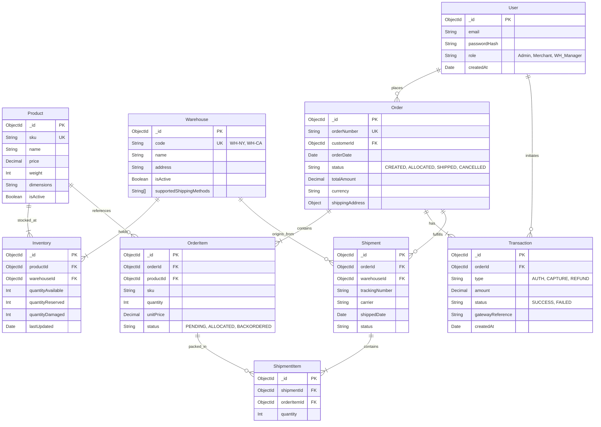

```mermaid
erDiagram
    %% User Management
    User {
        ObjectId _id PK
        String email
        String passwordHash
        String role "Admin, Merchant, WH_Manager"
        Date createdAt
    }

    %% Catalog & Inventory
    Product {
        ObjectId _id PK
        String sku UK
        String name
        Decimal price
        Int weight
        String dimensions
        Boolean isActive
    }

    Warehouse {
        ObjectId _id PK
        String code UK "WH-NY, WH-CA"
        String name
        String address
        Boolean isActive
        String[] supportedShippingMethods
    }

    Inventory {
        ObjectId _id PK
        ObjectId productId FK
        ObjectId warehouseId FK
        Int quantityAvailable
        Int quantityReserved
        Int quantityDamaged
        Date lastUpdated
    }

    %% Order Management
    Order {
        ObjectId _id PK
        String orderNumber UK
        ObjectId customerId FK
        Date orderDate
        String status "CREATED, ALLOCATED, SHIPPED, CANCELLED"
        Decimal totalAmount
        String currency
        Object shippingAddress
    }

    OrderItem {
        ObjectId _id PK
        ObjectId orderId FK
        ObjectId productId FK
        String sku
        Int quantity
        Decimal unitPrice
        String status "PENDING, ALLOCATED, BACKORDERED"
    }

    %% Fulfillment
    Shipment {
        ObjectId _id PK
        ObjectId orderId FK
        ObjectId warehouseId FK
        String trackingNumber
        String carrier
        Date shippedDate
        String status
    }

    ShipmentItem {
        ObjectId _id PK
        ObjectId shipmentId FK
        ObjectId orderItemId FK
        Int quantity
    }

    %% Finance
    Transaction {
        ObjectId _id PK
        ObjectId orderId FK
        String type "AUTH, CAPTURE, REFUND"
        Decimal amount
        String status "SUCCESS, FAILED"
        String gatewayReference
        Date createdAt
    }

    %% Relationships
    User ||--o{ Order : places
    User ||--o{ Transaction : initiates
    
    Order ||--|{ OrderItem : contains
    Order ||--|{ Transaction : has
    Order ||--o{ Shipment : fulfills

    Product ||--|{ Inventory : stocked_at
    Warehouse ||--|{ Inventory : holds
    Product ||--o{ OrderItem : references

    Shipment ||--|{ ShipmentItem : contains
    OrderItem ||--o{ ShipmentItem : packed_in
    Warehouse ||--o{ Shipment : origins_from
```
