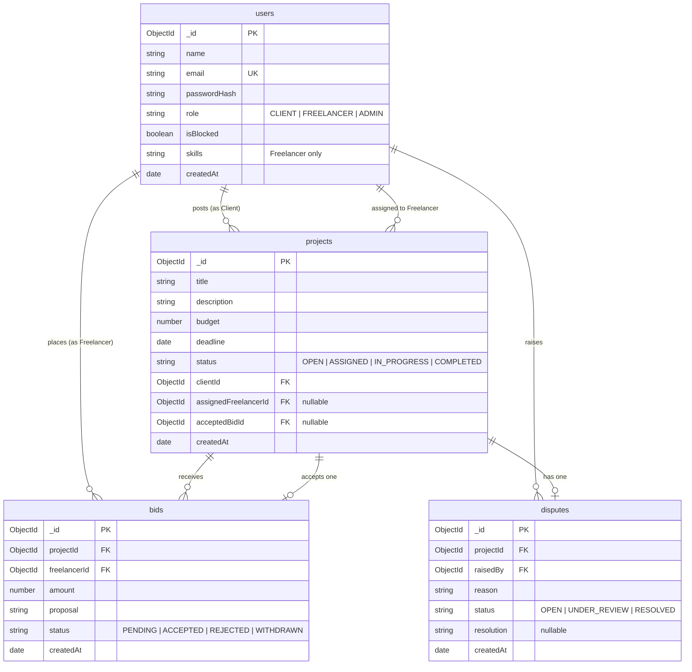

```mermaid
erDiagram
    %% ══════════════════════════════════════
    %% COLLECTIONS
    %% ══════════════════════════════════════

    users {
        ObjectId _id PK
        string name
        string email UK
        string passwordHash
        string role "CLIENT | FREELANCER | ADMIN"
        boolean isBlocked
        string skills "Freelancer only"
        date createdAt
    }

    projects {
        ObjectId _id PK
        string title
        string description
        number budget
        date deadline
        string status "OPEN | ASSIGNED | IN_PROGRESS | COMPLETED"
        ObjectId clientId FK
        ObjectId assignedFreelancerId FK "nullable"
        ObjectId acceptedBidId FK "nullable"
        date createdAt
    }

    bids {
        ObjectId _id PK
        ObjectId projectId FK
        ObjectId freelancerId FK
        number amount
        string proposal
        string status "PENDING | ACCEPTED | REJECTED | WITHDRAWN"
        date createdAt
    }

    disputes {
        ObjectId _id PK
        ObjectId projectId FK
        ObjectId raisedBy FK
        string reason
        string status "OPEN | UNDER_REVIEW | RESOLVED"
        string resolution "nullable"
        date createdAt
    }

    %% ══════════════════════════════════════
    %% RELATIONSHIPS
    %% ══════════════════════════════════════

    users ||--o{ projects : "posts (as Client)"
    users ||--o{ bids : "places (as Freelancer)"
    users ||--o{ disputes : "raises"

    projects ||--o{ bids : "receives"
    projects ||--o| bids : "accepts one"
    projects ||--o| disputes : "has one"
    projects }o--|| users : "assigned to Freelancer"
```
