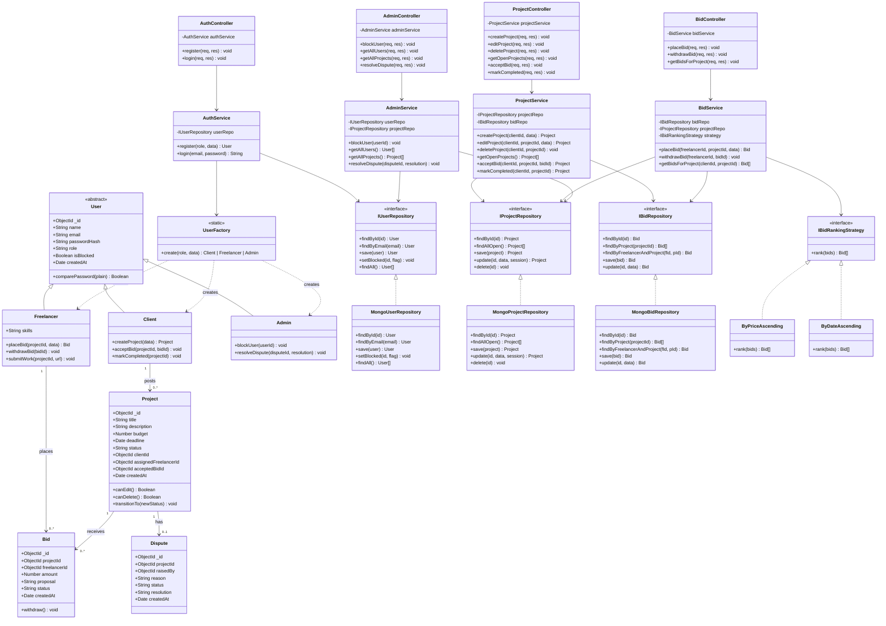

```mermaid
classDiagram
    %% ══════════════════════════════════════
    %% DOMAIN MODELS (Mongoose Schemas)
    %% ══════════════════════════════════════

    class User {
        <<abstract>>
        +ObjectId _id
        +String name
        +String email
        +String passwordHash
        +String role
        +Boolean isBlocked
        +Date createdAt
        +comparePassword(plain) Boolean
    }

    class Client {
        +createProject(data) Project
        +acceptBid(projectId, bidId) void
        +markCompleted(projectId) void
    }

    class Freelancer {
        +String skills
        +placeBid(projectId, data) Bid
        +withdrawBid(bidId) void
        +submitWork(projectId, url) void
    }

    class Admin {
        +blockUser(userId) void
        +resolveDispute(disputeId, resolution) void
    }

    class Project {
        +ObjectId _id
        +String title
        +String description
        +Number budget
        +Date deadline
        +String status
        +ObjectId clientId
        +ObjectId assignedFreelancerId
        +ObjectId acceptedBidId
        +Date createdAt
        +canEdit() Boolean
        +canDelete() Boolean
        +transitionTo(newStatus) void
    }

    class Bid {
        +ObjectId _id
        +ObjectId projectId
        +ObjectId freelancerId
        +Number amount
        +String proposal
        +String status
        +Date createdAt
        +withdraw() void
    }

    class Dispute {
        +ObjectId _id
        +ObjectId projectId
        +ObjectId raisedBy
        +String reason
        +String status
        +String resolution
        +Date createdAt
    }

    %% ══════════════════════════════════════
    %% REPOSITORY INTERFACES
    %% ══════════════════════════════════════

    class IUserRepository {
        <<interface>>
        +findById(id) User
        +findByEmail(email) User
        +save(user) User
        +setBlocked(id, flag) void
        +findAll() User[]
    }

    class IProjectRepository {
        <<interface>>
        +findById(id) Project
        +findAllOpen() Project[]
        +save(project) Project
        +update(id, data, session) Project
        +delete(id) void
    }

    class IBidRepository {
        <<interface>>
        +findById(id) Bid
        +findByProject(projectId) Bid[]
        +findByFreelancerAndProject(fId, pId) Bid
        +save(bid) Bid
        +update(id, data) Bid
    }

    %% ══════════════════════════════════════
    %% REPOSITORY IMPLEMENTATIONS
    %% ══════════════════════════════════════

    class MongoUserRepository {
        +findById(id) User
        +findByEmail(email) User
        +save(user) User
        +setBlocked(id, flag) void
        +findAll() User[]
    }

    class MongoProjectRepository {
        +findById(id) Project
        +findAllOpen() Project[]
        +save(project) Project
        +update(id, data, session) Project
        +delete(id) void
    }

    class MongoBidRepository {
        +findById(id) Bid
        +findByProject(projectId) Bid[]
        +findByFreelancerAndProject(fId, pId) Bid
        +save(bid) Bid
        +update(id, data) Bid
    }

    %% ══════════════════════════════════════
    %% FACTORY
    %% ══════════════════════════════════════

    class UserFactory {
        <<static>>
        +create(role, data) Client | Freelancer | Admin
    }

    %% ══════════════════════════════════════
    %% STRATEGY (Bid Ranking)
    %% ══════════════════════════════════════

    class IBidRankingStrategy {
        <<interface>>
        +rank(bids) Bid[]
    }

    class ByPriceAscending {
        +rank(bids) Bid[]
    }

    class ByDateAscending {
        +rank(bids) Bid[]
    }

    %% ══════════════════════════════════════
    %% SERVICE LAYER
    %% ══════════════════════════════════════

    class AuthService {
        -IUserRepository userRepo
        +register(role, data) User
        +login(email, password) String
    }

    class ProjectService {
        -IProjectRepository projectRepo
        -IBidRepository bidRepo
        +createProject(clientId, data) Project
        +editProject(clientId, projectId, data) Project
        +deleteProject(clientId, projectId) void
        +getOpenProjects() Project[]
        +acceptBid(clientId, projectId, bidId) Project
        +markCompleted(clientId, projectId) Project
    }

    class BidService {
        -IBidRepository bidRepo
        -IProjectRepository projectRepo
        -IBidRankingStrategy strategy
        +placeBid(freelancerId, projectId, data) Bid
        +withdrawBid(freelancerId, bidId) void
        +getBidsForProject(clientId, projectId) Bid[]
    }

    class AdminService {
        -IUserRepository userRepo
        -IProjectRepository projectRepo
        +blockUser(userId) void
        +getAllUsers() User[]
        +getAllProjects() Project[]
        +resolveDispute(disputeId, resolution) void
    }

    %% ══════════════════════════════════════
    %% CONTROLLER LAYER
    %% ══════════════════════════════════════

    class AuthController {
        -AuthService authService
        +register(req, res) void
        +login(req, res) void
    }

    class ProjectController {
        -ProjectService projectService
        +createProject(req, res) void
        +editProject(req, res) void
        +deleteProject(req, res) void
        +getOpenProjects(req, res) void
        +acceptBid(req, res) void
        +markCompleted(req, res) void
    }

    class BidController {
        -BidService bidService
        +placeBid(req, res) void
        +withdrawBid(req, res) void
        +getBidsForProject(req, res) void
    }

    class AdminController {
        -AdminService adminService
        +blockUser(req, res) void
        +getAllUsers(req, res) void
        +getAllProjects(req, res) void
        +resolveDispute(req, res) void
    }

    %% ══════════════════════════════════════
    %% RELATIONSHIPS
    %% ══════════════════════════════════════

    %% Inheritance
    User <|-- Client
    User <|-- Freelancer
    User <|-- Admin

    %% Factory creates role-specific users
    UserFactory ..> Client : creates
    UserFactory ..> Freelancer : creates
    UserFactory ..> Admin : creates

    %% Domain associations
    Client "1" --> "0..*" Project : posts
    Freelancer "1" --> "0..*" Bid : places
    Project "1" --> "0..*" Bid : receives
    Project "1" --> "0..1" Dispute : has

    %% Repository interface → implementation
    IUserRepository <|.. MongoUserRepository
    IProjectRepository <|.. MongoProjectRepository
    IBidRepository <|.. MongoBidRepository

    %% Strategy
    IBidRankingStrategy <|.. ByPriceAscending
    IBidRankingStrategy <|.. ByDateAscending

    %% Controllers → Services
    AuthController --> AuthService
    ProjectController --> ProjectService
    BidController --> BidService
    AdminController --> AdminService

    %% Services → Repositories
    AuthService --> IUserRepository
    ProjectService --> IProjectRepository
    ProjectService --> IBidRepository
    BidService --> IBidRepository
    BidService --> IProjectRepository
    BidService --> IBidRankingStrategy
    AdminService --> IUserRepository
    AdminService --> IProjectRepository

    %% Services → Factory
    AuthService --> UserFactory
```
