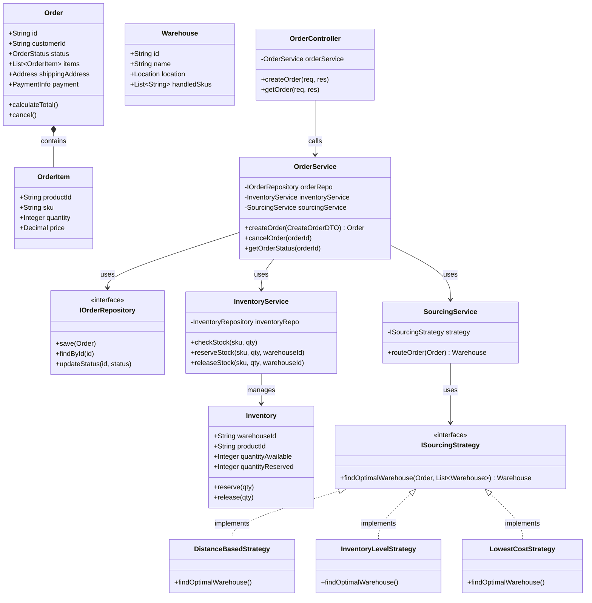

```mermaid
classDiagram
    %% Core Domain Models
    class Order {
        +String id
        +String customerId
        +OrderStatus status
        +List~OrderItem~ items
        +Address shippingAddress
        +PaymentInfo payment
        +calculateTotal()
        +cancel()
    }

    class OrderItem {
        +String productId
        +String sku
        +Integer quantity
        +Decimal price
    }

    class Inventory {
        +String warehouseId
        +String productId
        +Integer quantityAvailable
        +Integer quantityReserved
        +reserve(qty)
        +release(qty)
    }

    class Warehouse {
        +String id
        +String name
        +Location location
        +List~String~ handledSkus
    }

    %% Interfaces / Contracts
    class IOrderRepository {
        <<interface>>
        +save(Order)
        +findById(id)
        +updateStatus(id, status)
    }

    class ISourcingStrategy {
        <<interface>>
        +findOptimalWarehouse(Order, List~Warehouse~) Warehouse
    }

    %% Service Layer
    class OrderService {
        -IOrderRepository orderRepo
        -InventoryService inventoryService
        -SourcingService sourcingService
        +createOrder(CreateOrderDTO) Order
        +cancelOrder(orderId)
        +getOrderStatus(orderId)
    }

    class InventoryService {
        -InventoryRepository inventoryRepo
        +checkStock(sku, qty)
        +reserveStock(sku, qty, warehouseId)
        +releaseStock(sku, qty, warehouseId)
    }

    class SourcingService {
        -ISourcingStrategy strategy
        +routeOrder(Order) Warehouse
    }

    %% Strategy Implementations
    class DistanceBasedStrategy {
        +findOptimalWarehouse()
    }
    
    class InventoryLevelStrategy {
        +findOptimalWarehouse()
    }

    class LowestCostStrategy {
        +findOptimalWarehouse()
    }

    %% API Layer
    class OrderController {
        -OrderService orderService
        +createOrder(req, res)
        +getOrder(req, res)
    }

    %% Relationships
    Order *-- OrderItem : contains
    OrderService --> IOrderRepository : uses
    OrderService --> InventoryService : uses
    OrderService --> SourcingService : uses
    SourcingService --> ISourcingStrategy : uses
    ISourcingStrategy <|.. DistanceBasedStrategy : implements
    ISourcingStrategy <|.. InventoryLevelStrategy : implements
    ISourcingStrategy <|.. LowestCostStrategy : implements
    OrderController --> OrderService : calls
    InventoryService --> Inventory : manages
```
