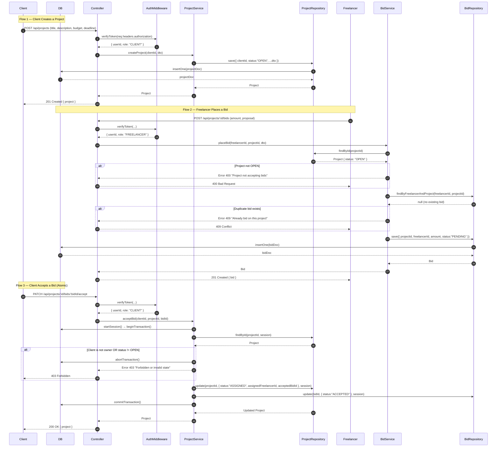

```mermaid
sequenceDiagram
    autonumber

    %% ══════════════════════════════════════════
    %% FLOW 1: Client Posts a Project
    %% ══════════════════════════════════════════
    Note over Client,DB: Flow 1 — Client Creates a Project

    Client->>Controller: POST /api/projects (title, description, budget, deadline)
    Controller->>AuthMiddleware: verifyToken(req.headers.authorization)
    AuthMiddleware-->>Controller: { userId, role: "CLIENT" }
    Controller->>ProjectService: createProject(clientId, dto)
    ProjectService->>ProjectRepository: save({ clientId, status:"OPEN", ...dto })
    ProjectRepository->>DB: insertOne(projectDoc)
    DB-->>ProjectRepository: projectDoc
    ProjectRepository-->>ProjectService: Project
    ProjectService-->>Controller: Project
    Controller-->>Client: 201 Created { project }

    %% ══════════════════════════════════════════
    %% FLOW 2: Freelancer Places a Bid
    %% ══════════════════════════════════════════
    Note over Freelancer,DB: Flow 2 — Freelancer Places a Bid

    Freelancer->>Controller: POST /api/projects/:id/bids (amount, proposal)
    Controller->>AuthMiddleware: verifyToken(...)
    AuthMiddleware-->>Controller: { userId, role: "FREELANCER" }
    Controller->>BidService: placeBid(freelancerId, projectId, dto)

    BidService->>ProjectRepository: findById(projectId)
    ProjectRepository-->>BidService: Project { status: "OPEN" }

    alt Project not OPEN
        BidService-->>Controller: Error 400 "Project not accepting bids"
        Controller-->>Freelancer: 400 Bad Request
    end

    BidService->>BidRepository: findByFreelancerAndProject(freelancerId, projectId)
    BidRepository-->>BidService: null (no existing bid)

    alt Duplicate bid exists
        BidService-->>Controller: Error 409 "Already bid on this project"
        Controller-->>Freelancer: 409 Conflict
    end

    BidService->>BidRepository: save({ projectId, freelancerId, amount, status:"PENDING" })
    BidRepository->>DB: insertOne(bidDoc)
    DB-->>BidRepository: bidDoc
    BidRepository-->>BidService: Bid
    BidService-->>Controller: Bid
    Controller-->>Freelancer: 201 Created { bid }

    %% ══════════════════════════════════════════
    %% FLOW 3: Client Accepts a Bid (Transactional)
    %% ══════════════════════════════════════════
    Note over Client,DB: Flow 3 — Client Accepts a Bid (Atomic)

    Client->>Controller: PATCH /api/projects/:id/bids/:bidId/accept
    Controller->>AuthMiddleware: verifyToken(...)
    AuthMiddleware-->>Controller: { userId, role: "CLIENT" }
    Controller->>ProjectService: acceptBid(clientId, projectId, bidId)

    ProjectService->>DB: startSession() → beginTransaction()
    ProjectService->>ProjectRepository: findById(projectId, session)
    ProjectRepository-->>ProjectService: Project

    alt Client is not owner OR status != OPEN
        ProjectService->>DB: abortTransaction()
        ProjectService-->>Controller: Error 403 "Forbidden or invalid state"
        Controller-->>Client: 403 Forbidden
    end

    ProjectService->>ProjectRepository: update(projectId, { status:"ASSIGNED", assignedFreelancerId, acceptedBidId }, session)
    ProjectService->>BidRepository: update(bidId, { status:"ACCEPTED" }, session)
    ProjectService->>DB: commitTransaction()

    ProjectRepository-->>ProjectService: Updated Project
    ProjectService-->>Controller: Project
    Controller-->>Client: 200 OK { project }
```
