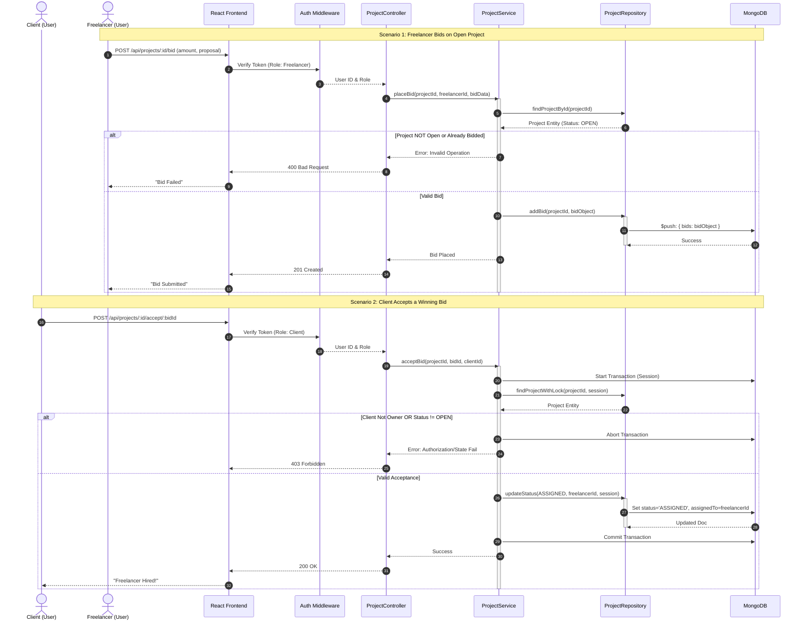

```mermaid
sequenceDiagram
    autonumber
    actor C as Client (User)
    actor F as Freelancer (User)
    participant API as React Frontend
    participant M as Auth Middleware
    participant Ctrl as ProjectController
    participant Svc as ProjectService
    participant Repo as ProjectRepository
    participant DB as MongoDB

    %% SECTION: Freelancer Places Bid
    Note over F, DB: Scenario 1: Freelancer Bids on Open Project
    F->>API: POST /api/projects/:id/bid (amount, proposal)
    API->>M: Verify Token (Role: Freelancer)
    M-->>Ctrl: User ID & Role
    Ctrl->>Svc: placeBid(projectId, freelancerId, bidData)
    
    activate Svc
    Svc->>Repo: findProjectById(projectId)
    Repo-->>Svc: Project Entity (Status: OPEN)

    alt Project NOT Open or Already Bidded
        Svc-->>Ctrl: Error: Invalid Operation
        Ctrl-->>API: 400 Bad Request
        API-->>F: "Bid Failed"
    else Valid Bid
        Svc->>Repo: addBid(projectId, bidObject)
        activate Repo
        Repo->>DB: $push: { bids: bidObject }
        DB-->>Repo: Success
        deactivate Repo
        Svc-->>Ctrl: Bid Placed
        Ctrl-->>API: 201 Created
        API-->>F: "Bid Submitted"
    end
    deactivate Svc

    %% SECTION: Client Accepts Bid
    Note over C, DB: Scenario 2: Client Accepts a Winning Bid
    C->>API: POST /api/projects/:id/accept/:bidId
    API->>M: Verify Token (Role: Client)
    M-->>Ctrl: User ID & Role

    Ctrl->>Svc: acceptBid(projectId, bidId, clientId)
    activate Svc
    
    %% Transaction Start
    Svc->>DB: Start Transaction (Session)
    
    Svc->>Repo: findProjectWithLock(projectId, session)
    Repo-->>Svc: Project Entity
    
    alt Client Not Owner OR Status != OPEN
        Svc->>DB: Abort Transaction
        Svc-->>Ctrl: Error: Authorization/State Fail
        Ctrl-->>API: 403 Forbidden
    else Valid Acceptance
        Svc->>Repo: updateStatus(ASSIGNED, freelancerId, session)
        activate Repo
        Repo->>DB: Set status='ASSIGNED', assignedTo=freelancerId
        DB-->>Repo: Updated Doc
        deactivate Repo

        Svc->>DB: Commit Transaction
        Svc-->>Ctrl: Success
        Ctrl-->>API: 200 OK
        API-->>C: "Freelancer Hired!"
    end
    deactivate Svc
```
