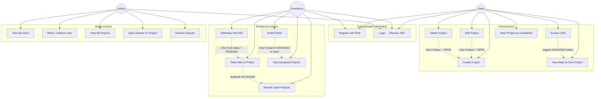

```mermaid
flowchart TD
    %% Actors
    CL((Client))
    FR((Freelancer))
    AD((Admin))

    %% ── Shared ──────────────────────────────
    subgraph AUTH["Authentication (All Roles)"]
        UC1[Register with Role]
        UC2[Login → Receive JWT]
    end

    %% ── Client ──────────────────────────────
    subgraph CLIENT["Client Actions"]
        UC3[Create Project]
        UC4[Edit Project]
        UC5[Delete Project]
        UC6[View Bids on Own Project]
        UC7[Accept a Bid]
        UC8[Mark Project as Completed]
    end

    %% ── Freelancer ──────────────────────────
    subgraph FREELANCER["Freelancer Actions"]
        UC9[Browse Open Projects]
        UC10[Place Bid on Project]
        UC11[Withdraw Own Bid]
        UC12[View Assigned Projects]
        UC13[Submit Work]
    end

    %% ── Admin ───────────────────────────────
    subgraph ADMIN["Admin Actions"]
        UC14[View All Users]
        UC15[Block / Unblock User]
        UC16[View All Projects]
        UC17[Open Dispute on Project]
        UC18[Resolve Dispute]
    end

    %% ── Connections ─────────────────────────
    CL --> UC1 & UC2
    CL --> UC3 & UC4 & UC5 & UC6 & UC7 & UC8

    FR --> UC1 & UC2
    FR --> UC9 & UC10 & UC11 & UC12 & UC13

    AD --> UC2
    AD --> UC14 & UC15 & UC16 & UC17 & UC18

    %% ── Business Rule Notes ─────────────────
    UC4 -. "only if status = OPEN" .-> UC3
    UC5 -. "only if status = OPEN" .-> UC3
    UC7 -. "triggers ASSIGNED status" .-> UC6
    UC10 -. "duplicate bid blocked" .-> UC9
    UC11 -. "only if bid status = PENDING" .-> UC10
    UC13 -. "only if project ASSIGNED to them" .-> UC12
```
