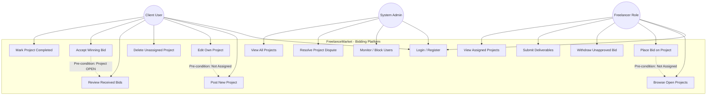

```mermaid
graph TD
    %% Actors
    Admin((System Admin))
    Client((Client User))
    Freelancer((Freelancer Role))

    %% Boundary
    subgraph "FreelanceMarket - Bidding Platform"
    
        %% Client Actions
        PostProject[Post New Project]
        EditProject[Edit Own Project]
        DeleteProject[Delete Unassigned Project]
        ReviewBids[Review Received Bids]
        AcceptBid[Accept Winning Bid]
        MarkComplete[Mark Project Completed]

        %% Freelancer Actions
        Browse[Browse Open Projects]
        PlaceBid[Place Bid on Project]
        WithdrawBid[Withdraw Unapproved Bid]
        SubmitWork[Submit Deliverables]
        ViewAssigned[View Assigned Projects]

        %% Admin Actions
        MonitorUsers[Monitor / Block Users]
        ResolveDispute[Resolve Project Dispute]
        ViewProjects[View All Projects]
        
        %% Shared
        Login[Login / Register]
    end

    %% Relationships
    Client --> Login
    Client --> PostProject
    Client --> EditProject
    Client --> DeleteProject
    Client --> ReviewBids
    Client --> AcceptBid
    Client --> MarkComplete

    Freelancer --> Login
    Freelancer --> Browse
    Freelancer --> PlaceBid
    Freelancer --> WithdrawBid
    Freelancer --> SubmitWork
    Freelancer --> ViewAssigned

    Admin --> Login
    Admin --> MonitorUsers
    Admin --> ResolveDispute
    Admin --> ViewProjects

    %% Includes / Constraints
    AcceptBid -.-> |Pre-condition: Project OPEN| ReviewBids
    PlaceBid -.-> |Pre-condition: Not Assigned| Browse
    EditProject -.-> |Pre-condition: Not Assigned| PostProject
```
